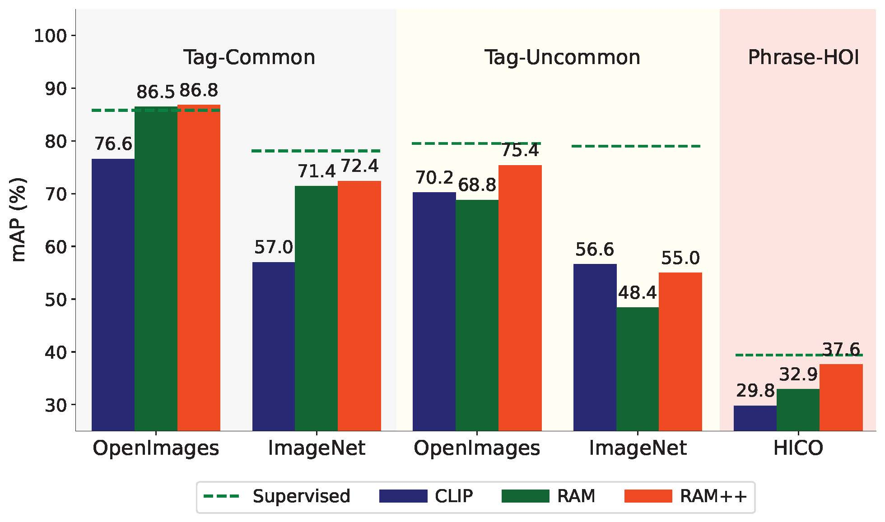
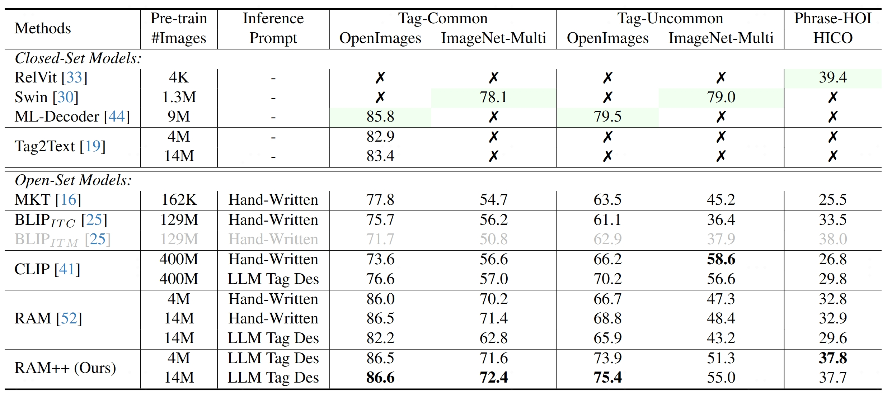
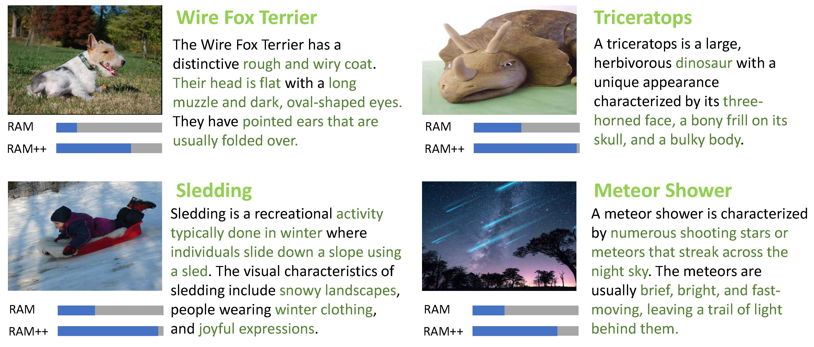
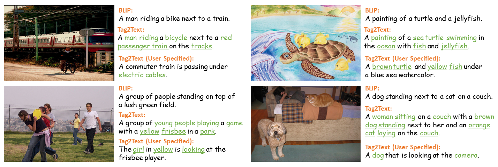
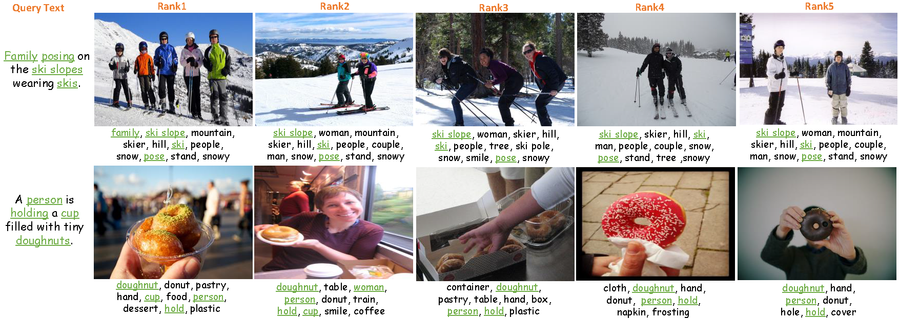

# <font size=8> :label: Recognize Anything Model </font>

This project aims to develop a series of open-source and strong fundamental image recognition models.

[](#open_book-training-datasets)
[](ram/data/ram_tag_list.txt)
[](https://huggingface.co/spaces/xinyu1205/Recognize_Anything-Tag2Text)
[](https://colab.research.google.com/github/mhd-medfa/recognize-anything/blob/main/recognize_anything_demo.ipynb)


- **Recognize Anything Plus Model (RAM++)** [[Paper](https://arxiv.org/abs/2310.15200)] <br>

  RAM++ is the next generation of RAM, which can **recognize any category with high accuracy**, including **both predefined common categories and diverse open-set categories**.

- **Recognize Anything Model (RAM)** [[Paper](https://arxiv.org/abs/2306.03514)][[Demo](https://huggingface.co/spaces/xinyu1205/recognize-anything)] <br>

  RAM is an image tagging model, which can **recognize any common category with high accuracy**.
  
  RAM is accepted at **CVPR 2024 Multimodal Foundation Models Workshop**.

- **Tag2Text (ICLR 2024)**  [[Paper](https://arxiv.org/abs/2303.05657)] [[Demo](https://huggingface.co/spaces/xinyu1205/recognize-anything)]<br>

  Tag2Text is a vision-language model guided by tagging, which can **support tagging and comprehensive captioning simultaneously**.
  
  Tag2Text is accepted at **ICLR 2024!** See you in Vienna!


## :bulb: Highlight

### **Superior Image Recognition Capability** 

RAM++ outperforms existing SOTA image fundamental recognition models on common tag categories, uncommon tag categories, and  human-object interaction phrases.

<p align="center">
 <table class="tg">
  <tr>
    <td class="tg-c3ow"></td>
  </tr>
</table>
   <p align="center">Comparison of zero-shot image recognition performance.</p>
</p>


### **Strong Visual Semantic Analysis** 


We have combined Tag2Text and RAM with localization models (Grounding-DINO and SAM) and developed a strong visual semantic analysis pipeline in the [Grounded-SAM](https://github.com/IDEA-Research/Grounded-Segment-Anything) project.


## :sunrise: Model Zoo

<details>
<summary><font size="3" style="font-weight:bold;">
RAM++
</font></summary> 

RAM++ is the next generation of RAM, which can recognize any category with high accuracy, including both predefined common categories and diverse open-set categories.


- **For Common Predefined Categoies.** RAM++ exhibits exceptional image tagging capabilities with powerful zero-shot generalization, which maintains the same capabilities as RAM.
    <!-- - RAM++ showcases impressive zero-shot performance, significantly outperforming CLIP and BLIP.
    - RAM++ even surpasses the fully supervised manners (ML-Decoder).
    - RAM++ exhibits competitive performance with the Google tagging API. -->
- **For Diverse Open-set Categoires.** RAM++ achieves notably enhancements beyond CLIP and RAM.
    <!-- - RAM++ integrate the image-tags-text triplets within a unified alignment framework.
    - RAM++ pioneer the intergation of LLM's knowledge into image tagging training. -->


<p align="center">
 <table class="tg">
  <tr>
    <td class="tg-c3ow"></td>
  </tr>
</table>
  <p align="center">(Green color means fully supervised learning and others means zero-shot performance.)</p>
</p>


<p align="center">
 <table class="tg">
  <tr>
    <td class="tg-c3ow"></td>
  </tr>
</table>
  <p align="center">RAM++ demonstrate a significant improvement in open-set category recognition.</p>
</p>


</details>


<details>
<summary><font size="3" style="font-weight:bold;">
RAM
</font></summary>


RAM is a strong image tagging model, which can recognize any common category with high accuracy.
- **Strong and general.** RAM exhibits exceptional image tagging capabilities with powerful zero-shot generalization;
    - RAM showcases impressive zero-shot performance, significantly outperforming CLIP and BLIP.
    - RAM even surpasses the fully supervised manners (ML-Decoder).
    - RAM exhibits competitive performance with the Google tagging API.
- **Reproducible and affordable.** RAM requires Low reproduction cost with open-source and annotation-free dataset;
- **Flexible and versatile.** RAM offers remarkable flexibility, catering to various application scenarios.


<p align="center">
 <table class="tg">
  <tr>
    <td class="tg-c3ow"></td>
  </tr>
</table>
  <p align="center">(Green color means fully supervised learning and Blue color means zero-shot performance.)</p>
</p>

<p align="center">
 <table class="tg">
  <tr>
    <td class="tg-c3ow"></td>
  </tr>
</table>
</p>

RAM significantly improves the tagging ability based on the Tag2text framework.
- **Accuracy.** RAM utilizes a **data engine** to **generate** additional annotations and **clean** incorrect ones,  **higher accuracy** compared to Tag2Text.
- **Scope.** RAM upgrades the number of fixed tags from  3,400+ to **[6,400+](./ram/data/ram_tag_list.txt)** (synonymous reduction to 4,500+ different semantic tags), covering **more valuable categories**.
  Moreover, RAM is equipped with **open-set capability**, feasible to recognize tags not seen during training


</details>


<details>
<summary><font size="3" style="font-weight:bold;">
Tag2text
</font></summary>


Tag2Text is an efficient and controllable vision-language model with tagging guidance.
- **Tagging.** Tag2Text recognizes **[3,400+](./ram/data/tag2text_ori_tag_list.txt)** commonly human-used categories without manual annotations.
- **Captioning.** Tag2Text integrates **tags information** into text generation as the **guiding elements**, resulting in **more controllable and comprehensive descriptions**. 
- **Retrieval.** Tag2Text provides **tags** as **additional visible alignment indicators** for image-text retrieval. 


<p align="center">
 <table class="tg">
  <tr>
    <td class="tg-c3ow"></td>
  </tr>
</table>
    <p align="center">Tag2Text generate more comprehensive captions with tagging guidance.</p>
</p>

<p align="center">
 <table class="tg">
  <tr>
    <td class="tg-c3ow"></td>
  </tr>
</table>
    <p align="center">Tag2Text provides tags as additional visible alignment indicators.</p>
</p>


</details>

<!-- ## :sparkles: Highlight Projects with other Models
- [Tag2Text/RAM with Grounded-SAM](https://github.com/IDEA-Research/Grounded-Segment-Anything) is trong and general pipeline for visual semantic analysis, which can automatically **recognize**, detect, and segment for an image!
- [Ask-Anything](https://github.com/OpenGVLab/Ask-Anything) is a multifunctional video question answering tool. Tag2Text provides powerful tagging and captioning capabilities as a fundamental component.
- [Prompt-can-anything](https://github.com/positive666/Prompt-Can-Anything) is a gradio web library that integrates SOTA multimodal large models, including Tag2text as the core model for graphic understanding -->


<!-- 
## :fire: News

- **`2023/10/30`**: We release the [Recognize Anything Model Plus Model(RAM++)](), checkpoints and inference code!
- **`2023/06/08`**: We release the [Recognize Anything Model (RAM) Tag2Text web demo 🤗](https://huggingface.co/spaces/xinyu1205/Recognize_Anything-Tag2Text), checkpoints and inference code!
- **`2023/06/07`**: We release the [Recognize Anything Model (RAM)](https://recognize-anything.github.io/), a strong image tagging model!
- **`2023/06/05`**: Tag2Text is combined with [Prompt-can-anything](https://github.com/OpenGVLab/Ask-Anything).
- **`2023/05/20`**: Tag2Text is combined with [VideoChat](https://github.com/OpenGVLab/Ask-Anything).
- **`2023/04/20`**: We marry Tag2Text with with [Grounded-SAM](https://github.com/IDEA-Research/Grounded-Segment-Anything).
- **`2023/04/10`**: Code and checkpoint is available Now!
- **`2023/03/14`**: [Tag2Text web demo 🤗](https://huggingface.co/spaces/xinyu1205/Recognize_Anything-Tag2Text) is available on Hugging Face Space!   -->


<!-- 
## :writing_hand: TODO 

- [x] Release checkpoints.
- [x] Release inference code.
- [x] Release demo and checkpoints.
- [x] Release training codes.
- [x] Release training datasets.
- [ ] Release full training codes and scripts. -->


## :open_book: Training Datasets

### **Image Texts and Tags** 

These annotation files come from the [Tag2Text](https://arxiv.org/abs/2303.05657) and [RAM](https://recognize-anything.github.io/). Tag2Text automatically extracts image tags from image-text pairs. RAM further augments both tags and texts via an automatic data engine.


| DataSet  | Size    | Images | Texts | Tags  |
|----------|---------|--------|-------|-------|
| [COCO](https://huggingface.co/datasets/xinyu1205/recognize-anything-dataset/blob/main/coco_train_rmcocodev_ram.json)     | 168 MB  | 113K   | 680K  | 3.2M  |
| [VG](https://huggingface.co/datasets/xinyu1205/recognize-anything-dataset/blob/main/vg_ram.json)       | 55 MB   | 100K   | 923K  | 2.7M  |
| [SBU](https://huggingface.co/datasets/xinyu1205/recognize-anything-dataset/blob/main/sbu_ram.json)      | 234 MB  | 849K   | 1.7M  | 7.6M  |
| [CC3M](https://huggingface.co/datasets/xinyu1205/recognize-anything-dataset/blob/main/cc3m_train_ram.json)     | 766 MB  | 2.8M   | 5.6M  | 28.2M |
| [CC3M-val](https://huggingface.co/datasets/xinyu1205/recognize-anything-dataset/blob/main/cc3m_val_ram.json) | 3.5 MB  | 12K    | 26K   | 132K  |

CC12M to be released in the next update.

### **LLM Tag Descriptions** 

These tag descriptions files come from the [RAM++](https://arxiv.org/abs/2310.15200) by calling GPT api. You can also customize any tag categories by [generate_tag_des_llm.py](generate_tag_des_llm.py).

| Tag Descriptions    | Tag List |
|---------------------|----------|
| [RAM Tag List](https://huggingface.co/datasets/xinyu1205/recognize-anything-plus-model-tag-descriptions/blob/main/ram_tag_list_4585_llm_tag_descriptions.json)        | [4,585](ram/data/ram_tag_list.txt)    |
| [OpenImages Uncommon](./datasets/openimages_rare_200/openimages_rare_200_llm_tag_descriptions.json) | [200](datasets/openimages_rare_200/openimages_rare_200_ram_taglist.txt)      |

## :toolbox: Checkpoints

<!-- insert a table -->
<table>
  <thead>
    <tr style="text-align: right;">
      <th></th>
      <th>Name</th>
      <th>Backbone</th>
      <th>Data</th>
      <th>Illustration</th>
      <th>Checkpoint</th>
    </tr>
  </thead>
  <tbody>
    <tr>
      <th>1</th>
      <td>RAM++ (14M)</td>
      <td>Swin-Base</td>
      <td>COCO, VG, SBU, CC3M, CC3M-val, CC12M</td>
      <td>Provide strong image tagging ability for any category.</td>
      <td><a href="https://huggingface.co/xinyu1205/recognize-anything-plus-model/blob/main/ram_plus_swin_large_14m.pth">Download  link</a></td>
    </tr>
    <tr>
      <th>2</th>
      <td>RAM (14M)</td>
      <td>Swin-Large</td>
      <td>COCO, VG, SBU, CC3M, CC3M-val, CC12M</td>
      <td>Provide strong image tagging ability for common category.</td>
      <td><a href="https://huggingface.co/spaces/xinyu1205/Recognize_Anything-Tag2Text/blob/main/ram_swin_large_14m.pth">Download  link</a></td>
    </tr>
    <tr>
      <th>3</th>
      <td>Tag2Text (14M)</td>
      <td>Swin-Base</td>
      <td>COCO, VG, SBU, CC3M, CC3M-val, CC12M</td>
      <td>Support comprehensive captioning and tagging.</td>
      <td><a href="https://huggingface.co/spaces/xinyu1205/Recognize_Anything-Tag2Text/blob/main/tag2text_swin_14m.pth">Download  link</a></td>
    </tr>
  </tbody>
</table>


## :running: Model Inference

### **Setting Up** ###

1. Install recognize-anything as a package:

```bash
pip install git+https://github.com/xinyu1205/recognize-anything.git
```

2. Or, for development, you may build from source

```bash
git clone https://github.com/xinyu1205/recognize-anything.git
cd recognize-anything
pip install -e .
```

Then the RAM++, RAM and Tag2Text model can be imported in other projects:

```python
from ram.models import ram_plus, ram, tag2text
```

### **RAM++ Inference** ##

Get the English and Chinese outputs of the images:

<pre/>
python inference_ram_plus.py  --image images/demo/demo1.jpg \
--pretrained pretrained/ram_plus_swin_large_14m.pth
</pre>

The output will look like the following:

```
Image Tags:  armchair | blanket | lamp | carpet | couch | dog | gray | green | hassock | home | lay | living room | picture frame | pillow | plant | room | wall lamp | sit | wood floor
图像标签:  扶手椅  | 毯子/覆盖层 | 灯  | 地毯  | 沙发 | 狗 | 灰色 | 绿色  | 坐垫/搁脚凳/草丛 | 家/住宅 | 躺  | 客厅  | 相框  | 枕头  | 植物  | 房间  | 壁灯  | 坐/放置/坐落 | 木地板
```

### **RAM++ Inference on Unseen Categories (Open-Set)** ##

1. Get the [OpenImages-Uncommon categories](./datasets/openimages_rare_200/openimages_rare_200_ram_taglist.txt) of the image:

We have released the LLM tag descriptions of OpenImages-Uncommon categories in [openimages_rare_200_llm_tag_descriptions](./datasets/openimages_rare_200/).

<pre/>
python inference_ram_plus_openset.py  --image images/openset_example.jpg \
--pretrained pretrained/ram_plus_swin_large_14m.pth \
--llm_tag_des datasets/openimages_rare_200/openimages_rare_200_llm_tag_descriptions.json
</pre>

The output will look like the following:
```
Image Tags: Close-up | Compact car | Go-kart | Horse racing | Sport utility vehicle | Touring car
```

2. You can also customize any tag categories for recognition through tag descriptions:

Modify [categories](./generate_tag_des_llm.py#L56), and call GPT api to generate corresponding tag descriptions:

<pre/>
python generate_tag_des_llm.py \
--openai_api_key 'your openai api key' \
--output_file_path datasets/openimages_rare_200/openimages_rare_200_llm_tag_descriptions.json
</pre>

<details>
<summary><font size="4" style="font-weight:bold;">
RAM Inference
</font></summary>

Get the English and Chinese outputs of the images:

<pre/>
python inference_ram.py  --image images/demo/demo1.jpg \
--pretrained pretrained/ram_swin_large_14m.pth
</pre>

The output will look like the following:

```
Image Tags:  armchair | blanket | lamp | carpet | couch | dog | floor | furniture | gray | green | living room | picture frame | pillow | plant | room | sit | stool | wood floor
图像标签:  扶手椅  | 毯子/覆盖层 | 灯  | 地毯  | 沙发 | 狗 | 地板/地面 | 家具  | 灰色 | 绿色  | 客厅  | 相框  | 枕头  | 植物  | 房间  | 坐/放置/坐落 | 凳子  | 木地板 
```

</details>


<details>
<summary><font size="4" style="font-weight:bold;">
RAM Inference on Unseen Categories (Open-Set)
</font></summary>


Firstly, custom recognition categories in [build_openset_label_embedding](./ram/utils/openset_utils.py), then get the tags of the images:

<pre/>
python inference_ram_openset.py  --image images/openset_example.jpg \
--pretrained pretrained/ram_swin_large_14m.pth
</pre>

The output will look like the following:
```
Image Tags: Black-and-white | Go-kart
```


</details>

<details>
<summary><font size="4" style="font-weight:bold;">
Tag2Text Inference
</font></summary>


Get the tagging and captioning results:
<pre/>
python inference_tag2text.py  --image images/demo/demo1.jpg \
--pretrained pretrained/tag2text_swin_14m.pth
</pre>
Or get the tagging and sepcifed captioning results (optional):
<pre/>python inference_tag2text.py  --image images/demo/demo1.jpg \
--pretrained pretrained/tag2text_swin_14m.pth \
--specified-tags "cloud,sky"</pre>

</details>

### **Batch Inference and Evaluation** ##
We release two datasets `OpenImages-common` (214 common tag classes) and `OpenImages-rare` (200 uncommon tag classes). Copy or sym-link test images of [OpenImages v6](https://storage.googleapis.com/openimages/web/download_v6.html) to `datasets/openimages_common_214/imgs/` and `datasets/openimages_rare_200/imgs`.

To evaluate RAM++ on `OpenImages-common`:

```bash
python batch_inference.py \
  --model-type ram_plus \
  --checkpoint pretrained/ram_plus_swin_large_14m.pth \
  --dataset openimages_common_214 \
  --output-dir outputs/ram_plus
```

To evaluate RAM++ open-set capability on `OpenImages-rare`:

```bash
python batch_inference.py \
  --model-type ram_plus \
  --checkpoint pretrained/ram_plus_swin_large_14m.pth \
  --open-set \
  --dataset openimages_rare_200 \
  --output-dir outputs/ram_plus_openset
```

To evaluate RAM on `OpenImages-common`:

```bash
python batch_inference.py \
  --model-type ram \
  --checkpoint pretrained/ram_swin_large_14m.pth \
  --dataset openimages_common_214 \
  --output-dir outputs/ram
```

To evaluate RAM open-set capability on `OpenImages-rare`:

```bash
python batch_inference.py \
  --model-type ram \
  --checkpoint pretrained/ram_swin_large_14m.pth \
  --open-set \
  --dataset openimages_rare_200 \
  --output-dir outputs/ram_openset
```

To evaluate Tag2Text on `OpenImages-common`:

```bash
python batch_inference.py \
  --model-type tag2text \
  --checkpoint pretrained/tag2text_swin_14m.pth \
  --dataset openimages_common_214 \
  --output-dir outputs/tag2text
```

Please refer to `batch_inference.py` for more options. To get P/R in table 3 of RAM paper, pass `--threshold=0.86` for RAM and `--threshold=0.68` for Tag2Text.

To batch inference custom images, you can set up you own datasets following the given two datasets.


## :golfing: Model Training/Finetuning

### **RAM++** ##

1. Download [RAM training datasets](#open_book-training-datasets) where each json file contains a list. Each item in the list is a dictonary with three key-value pairs: {'image_path': path_of_image, 'caption': text_of_image, 'union_label_id': image tags for tagging which including parsed tags and pseudo tags }.

2. In ram/configs/pretrain.yaml, set 'train_file' as the paths for the json files.

3. Prepare [pretained Swin-Transformer](https://github.com/microsoft/Swin-Transformer), and set 'ckpt' in ram/configs/swin.

4. Download RAM++ frozen tag embedding file "[ram_plus_tag_embedding_class_4585_des_51.pth](https://huggingface.co/xinyu1205/recognize-anything-plus-model/blob/main/ram_plus_tag_embedding_class_4585_des_51.pth)", and set file in "ram/data/frozen_tag_embedding/ram_plus_tag_embedding_class_4585_des_51.pth"

5. Pre-train the model using 8 A100 GPUs:

```bash
python -m torch.distributed.run --nproc_per_node=8 pretrain.py \
  --model-type ram_plus \
  --config ram/configs/pretrain.yaml  \
  --output-dir outputs/ram_plus
```

6. Fine-tune the pre-trained checkpoint using 8 A100 GPUs:

```bash
python -m torch.distributed.run --nproc_per_node=8 finetune.py \
  --model-type ram_plus \
  --config ram/configs/finetune.yaml  \
  --checkpoint outputs/ram_plus/checkpoint_04.pth \
  --output-dir outputs/ram_plus_ft
```


<details>
<summary><font size="4" style="font-weight:bold;">
RAM 
</font></summary>

1. Download [RAM training datasets](#open_book-training-datasets) where each json file contains a list. Each item in the list is a dictonary with four key-value pairs: {'image_path': path_of_image, 'caption': text_of_image, 'union_label_id': image tags for tagging which including parsed tags and pseudo tags, 'parse_label_id': image tags parsed from caption }.

2. In ram/configs/pretrain.yaml, set 'train_file' as the paths for the json files.

3. Prepare [pretained Swin-Transformer](https://github.com/microsoft/Swin-Transformer), and set 'ckpt' in ram/configs/swin.

4. Download RAM frozen tag embedding file "[ram_tag_embedding_class_4585.pth](https://huggingface.co/xinyu1205/recognize_anything_model/blob/main/ram_tag_embedding_class_4585.pth)", and set file in "ram/data/frozen_tag_embedding/ram_tag_embedding_class_4585.pth"

5. Pre-train the model using 8 A100 GPUs:

```bash
python -m torch.distributed.run --nproc_per_node=8 pretrain.py \
  --model-type ram \
  --config ram/configs/pretrain.yaml  \
  --output-dir outputs/ram
```

6. Fine-tune the pre-trained checkpoint using 8 A100 GPUs:

```bash
python -m torch.distributed.run --nproc_per_node=8 finetune.py \
  --model-type ram \
  --config ram/configs/finetune.yaml  \
  --checkpoint outputs/ram/checkpoint_04.pth \
  --output-dir outputs/ram_ft
```

</details>


<details>
<summary><font size="4" style="font-weight:bold;">
Tag2Text 
</font></summary>

1. Download [RAM training datasets](#open_book-training-datasets) where each json file contains a list. Each item in the list is a dictonary with three key-value pairs: {'image_path': path_of_image, 'caption': text_of_image, 'parse_label_id': image tags parsed from caption }.

2. In ram/configs/pretrain_tag2text.yaml, set 'train_file' as the paths for the json files.

3. Prepare [pretained Swin-Transformer](https://github.com/microsoft/Swin-Transformer), and set 'ckpt' in ram/configs/swin.

4. Pre-train the model using 8 A100 GPUs:

```bash
python -m torch.distributed.run --nproc_per_node=8 pretrain.py \
  --model-type tag2text \
  --config ram/configs/pretrain_tag2text.yaml  \
  --output-dir outputs/tag2text
```

5. Fine-tune the pre-trained checkpoint using 8 A100 GPUs:

```bash
python -m torch.distributed.run --nproc_per_node=8 finetune.py \
  --model-type tag2text \
  --config ram/configs/finetune_tag2text.yaml  \
  --checkpoint outputs/tag2text/checkpoint_04.pth \
  --output-dir outputs/tag2text_ft
```

</details>


## :black_nib: Citation
If you find our work to be useful for your research, please consider citing.

```
@article{huang2023open,
  title={Open-Set Image Tagging with Multi-Grained Text Supervision},
  author={Huang, Xinyu and Huang, Yi-Jie and Zhang, Youcai and Tian, Weiwei and Feng, Rui and Zhang, Yuejie and Xie, Yanchun and Li, Yaqian and Zhang, Lei},
  journal={arXiv e-prints},
  pages={arXiv--2310},
  year={2023}
}

@article{zhang2023recognize,
  title={Recognize Anything: A Strong Image Tagging Model},
  author={Zhang, Youcai and Huang, Xinyu and Ma, Jinyu and Li, Zhaoyang and Luo, Zhaochuan and Xie, Yanchun and Qin, Yuzhuo and Luo, Tong and Li, Yaqian and Liu, Shilong and others},
  journal={arXiv preprint arXiv:2306.03514},
  year={2023}
}

@article{huang2023tag2text,
  title={Tag2Text: Guiding Vision-Language Model via Image Tagging},
  author={Huang, Xinyu and Zhang, Youcai and Ma, Jinyu and Tian, Weiwei and Feng, Rui and Zhang, Yuejie and Li, Yaqian and Guo, Yandong and Zhang, Lei},
  journal={arXiv preprint arXiv:2303.05657},
  year={2023}
}
```

## :hearts: Acknowledgements
This work is done with the help of the amazing code base of [BLIP](https://github.com/salesforce/BLIP), thanks very much!

We want to thank @Cheng Rui @Shilong Liu @Ren Tianhe for their help in [marrying RAM/Tag2Text with Grounded-SAM](https://github.com/IDEA-Research/Grounded-Segment-Anything).

We also want to thank [Ask-Anything](https://github.com/OpenGVLab/Ask-Anything), [Prompt-can-anything](https://github.com/positive666/Prompt-Can-Anything) for  combining RAM/Tag2Text, which greatly expands the application boundaries of RAM/Tag2Text.
