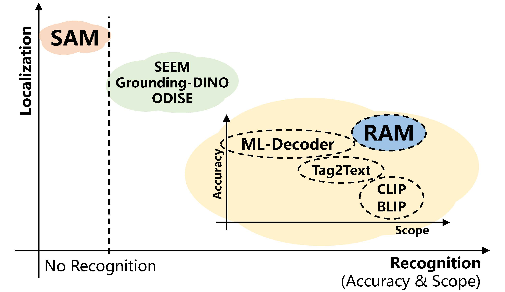
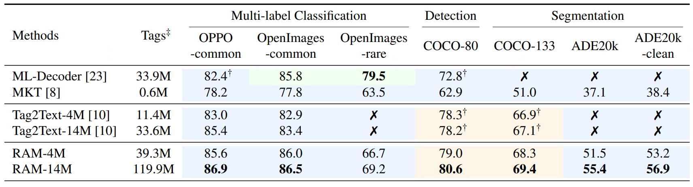
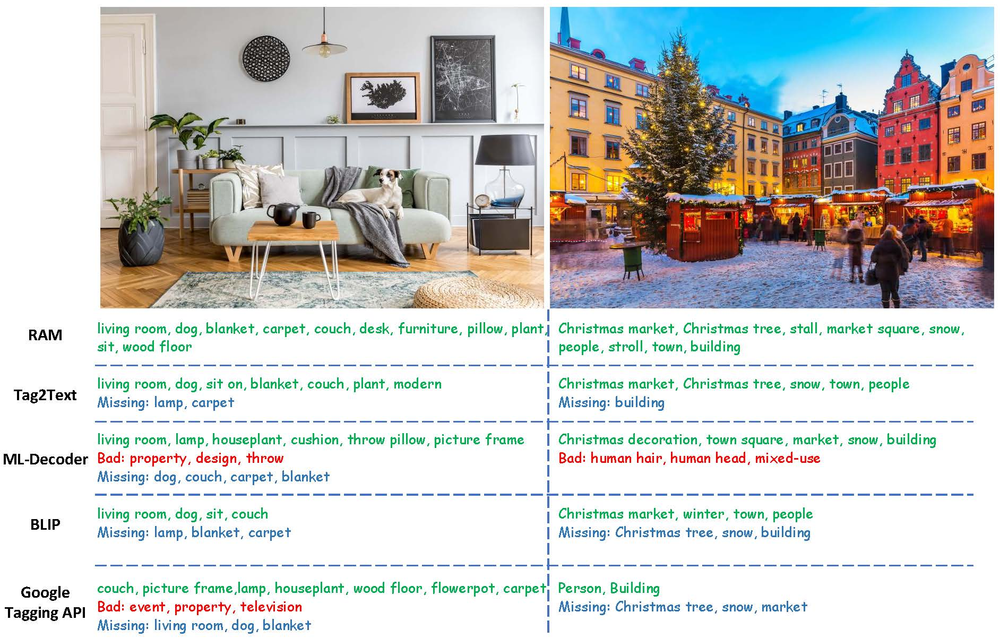

# <font size=8> :label: Recognize Anything: A Strong Image Tagging Model & Tag2Text: Guiding Vision-Language Model via Image Tagging </font>

Official PyTorch Implementation of the <a href="https://recognize-anything.github.io/">Recognize Anything Model (RAM)</a> and the <a href="https://tag2text.github.io/">Tag2Text Model</a>.

- RAM is an image tagging model, which can recognize any common category with high accuracy.
- Tag2Text is a vision-language model guided by tagging, which can support caption, retrieval and tagging.


Welcome to try our [RAM & Tag2Text web Demo! 🤗](https://huggingface.co/spaces/xinyu1205/Recognize_Anything-Tag2Text)


Both Tag2Text and RAM exihibit strong recognition ability. 
We have combined Tag2Text and RAM with localization models (Grounding-DINO and SAM) and developed a strong visual semantic analysis pipeline in the [Grounded-SAM](https://github.com/IDEA-Research/Grounded-Segment-Anything) project.


## :bulb: Highlight

<!-- **Recognition and localization are two foundation computer vision tasks.**
- **The Segment Anything Model (SAM)** excels in **localization capabilities**, while it falls short when it comes to **recognition tasks**.
- **The Recognize Anything Model (RAM) and Tag2Text** exhibits **exceptional recognition abilities**, in terms of **both accuracy and scope**.

<p align="center">
 <table class="tg">
  <tr>
    <td class="tg-c3ow"></td>
  </tr>
</table>
</p> -->

<!-- **Recognition and localization are two foundation computer vision tasks.** -->
- **The Recognize Anything Model (RAM) and Tag2Text** exhibits **exceptional recognition abilities**, in terms of **both accuracy and scope**.
- Especially, **RAM’s zero-shot generalization is superior to ML-Decoder’s full supervision on [OpenImages-common categories test dataset](./data/test_file/openimages_common_218class.txt).**


<p align="center">
 <table class="tg">
  <tr>
    <td class="tg-c3ow"></td>
  </tr>
  <p align="center">(Green color means fully supervised learning and Blue color means zero-shot performance.)</p>
</table>
</p>


<details close>
<summary><font size="4">
Tag2Text for Vision-Language Tasks.
</font></summary>

- **Tagging.** Without manual annotations, Tag2Text achieves **superior** image tag recognition ability of [**3,429**](./data/tag_list.txt) commonly human-used categories.
- **Captioning.** Tag2Text integrates **recognized image tags** into text generation as **guiding elements**, resulting in the generation with **more comprehensive text descriptions**. 
- **Retrieval.** Tag2Text provides **tags** as **additional visible alignment indicators.**


<p align="center">
 <table class="tg">
  <tr>
    <td class="tg-c3ow"></td>
  </tr>
</table>
</p>
</details>


<details close>
<summary><font size="4">
Advancements of RAM on Tag2Text.
</font></summary>

- **Accuracy.** RAM utilizes a **data engine** to **generate** additional annotations and **clean** incorrect ones, resulting **higher accuracy** compared to Tag2Text.
- **Scope.** Tag2Text recognizes 3,400+ fixed tags. RAM upgrades the number to **[6,400+](./data/ram_tag_list.txt)**, covering **more valuable categories**. With **open-set capability**, RAM is feasible to recognize **any common category**.

<p align="center">
 <table class="tg">
  <tr>
    <td class="tg-c3ow"></td>
  </tr>
</table>
</p>


</details>


<!-- ## :sparkles: Highlight Projects with other Models
- [Tag2Text/RAM with Grounded-SAM](https://github.com/IDEA-Research/Grounded-Segment-Anything) is trong and general pipeline for visual semantic analysis, which can automatically **recognize**, detect, and segment for an image!
- [Ask-Anything](https://github.com/OpenGVLab/Ask-Anything) is a multifunctional video question answering tool. Tag2Text provides powerful tagging and captioning capabilities as a fundamental component.
- [Prompt-can-anything](https://github.com/positive666/Prompt-Can-Anything) is a gradio web library that integrates SOTA multimodal large models, including Tag2text as the core model for graphic understanding -->


<!-- 
## :fire: News

- **`2023/06/08`**: We release the [Recognize Anything Model (RAM) Tag2Text web demo 🤗](https://huggingface.co/spaces/xinyu1205/Recognize_Anything-Tag2Text), checkpoints and inference code!
- **`2023/06/07`**: We release the [Recognize Anything Model (RAM)](https://recognize-anything.github.io/), a strong image tagging model!
- **`2023/06/05`**: Tag2Text is combined with [Prompt-can-anything](https://github.com/OpenGVLab/Ask-Anything).
- **`2023/05/20`**: Tag2Text is combined with [VideoChat](https://github.com/OpenGVLab/Ask-Anything).
- **`2023/04/20`**: We marry Tag2Text with with [Grounded-SAM](https://github.com/IDEA-Research/Grounded-Segment-Anything).
- **`2023/04/10`**: Code and checkpoint is available Now!
- **`2023/03/14`**: [Tag2Text web demo 🤗](https://huggingface.co/spaces/xinyu1205/Recognize_Anything-Tag2Text) is available on Hugging Face Space!  -->


## :writing_hand: TODO 

- [x] Release Tag2Text demo.
- [x] Release checkpoints.
- [x] Release inference code.
- [x] Release RAM demo and checkpoints.
- [ ] Release training codes (until July 8st at the latest).
- [ ] Release training datasets (until July 15st at the latest).


## :toolbox: Checkpoints

<!-- insert a table -->
<table>
  <thead>
    <tr style="text-align: right;">
      <th></th>
      <th>Name</th>
      <th>Backbone</th>
      <th>Data</th>
      <th>Illustration</th>
      <th>Checkpoint</th>
    </tr>
  </thead>
  <tbody>
    <tr>
      <th>1</th>
      <td>RAM-14M</td>
      <td>Swin-Large</td>
      <td>COCO, VG, SBU, CC-3M, CC-12M</td>
      <td>Provide strong image tagging ability.</td>
      <td><a href="https://huggingface.co/spaces/xinyu1205/Recognize_Anything-Tag2Text/blob/main/ram_swin_large_14m.pth">Download  link</a></td>
    </tr>
    <tr>
      <th>2</th>
      <td>Tag2Text-14M</td>
      <td>Swin-Base</td>
      <td>COCO, VG, SBU, CC-3M, CC-12M</td>
      <td>Support comprehensive captioning and tagging.</td>
      <td><a href="https://huggingface.co/spaces/xinyu1205/Recognize_Anything-Tag2Text/blob/main/tag2text_swin_14m.pth">Download  link</a></td>
    </tr>
  </tbody>
</table>


## :running: Model Inference
### **RAM Inference** ##
1. Install the dependencies, run:

<pre/>pip install -r requirements.txt</pre> 

2. Download RAM pretrained checkpoints.

3. Get the English and Chinese outputs of the images:
<pre/>
python inference_ram.py  --image images/1641173_2291260800.jpg \
--pretrained pretrained/ram_swin_large_14m.pth
</pre>

### **RAM Inference on Zero-Shot Categories** ##
1. Install the dependencies, run:

<pre/>pip install -r requirements.txt</pre> 

2. Download RAM pretrained checkpoints.

3. Custom recognition categories in [build_zeroshot_label_embedding](./models/zs_utils.py). 

4. Get the tags of the images:
<pre/>
python inference_ram_zeroshot_class.py  --image images/zeroshot_example.jpg \
--pretrained pretrained/ram_swin_large_14m.pth
</pre>


### **Tag2Text Inference** ##

1. Install the dependencies, run:

<pre/>pip install -r requirements.txt</pre> 

2. Download Tag2Text pretrained checkpoints.

3. Get the tagging and captioning results:
<pre/>
python inference_tag2text.py  --image images/1641173_2291260800.jpg \
--pretrained pretrained/tag2text_swin_14m.pth
</pre>
Or get the tagging and sepcifed captioning results (optional):
<pre/>python inference_tag2text.py  --image images/1641173_2291260800.jpg \
--pretrained pretrained/tag2text_swin_14m.pth \
--specified-tags "cloud,sky"</pre>


## :black_nib: Citation
If you find our work to be useful for your research, please consider citing.

```
@article{zhang2023recognize,
  title={Recognize Anything: A Strong Image Tagging Model},
  author={Zhang, Youcai and Huang, Xinyu and Ma, Jinyu and Li, Zhaoyang and Luo, Zhaochuan and Xie, Yanchun and Qin, Yuzhuo and Luo, Tong and Li, Yaqian and Liu, Shilong and others},
  journal={arXiv preprint arXiv:2306.03514},
  year={2023}
}

@article{huang2023tag2text,
  title={Tag2Text: Guiding Vision-Language Model via Image Tagging},
  author={Huang, Xinyu and Zhang, Youcai and Ma, Jinyu and Tian, Weiwei and Feng, Rui and Zhang, Yuejie and Li, Yaqian and Guo, Yandong and Zhang, Lei},
  journal={arXiv preprint arXiv:2303.05657},
  year={2023}
}
```

## :hearts: Acknowledgements
This work is done with the help of the amazing code base of [BLIP](https://github.com/salesforce/BLIP), thanks very much!

We want to thank @Cheng Rui @Shilong Liu @Ren Tianhe for their help in [marrying RAM/Tag2Text with Grounded-SAM](https://github.com/IDEA-Research/Grounded-Segment-Anything).

We also want to thank [Ask-Anything](https://github.com/OpenGVLab/Ask-Anything), [Prompt-can-anything](https://github.com/positive666/Prompt-Can-Anything) for  combining RAM/Tag2Text, which greatly expands the application boundaries of RAM/Tag2Text.


